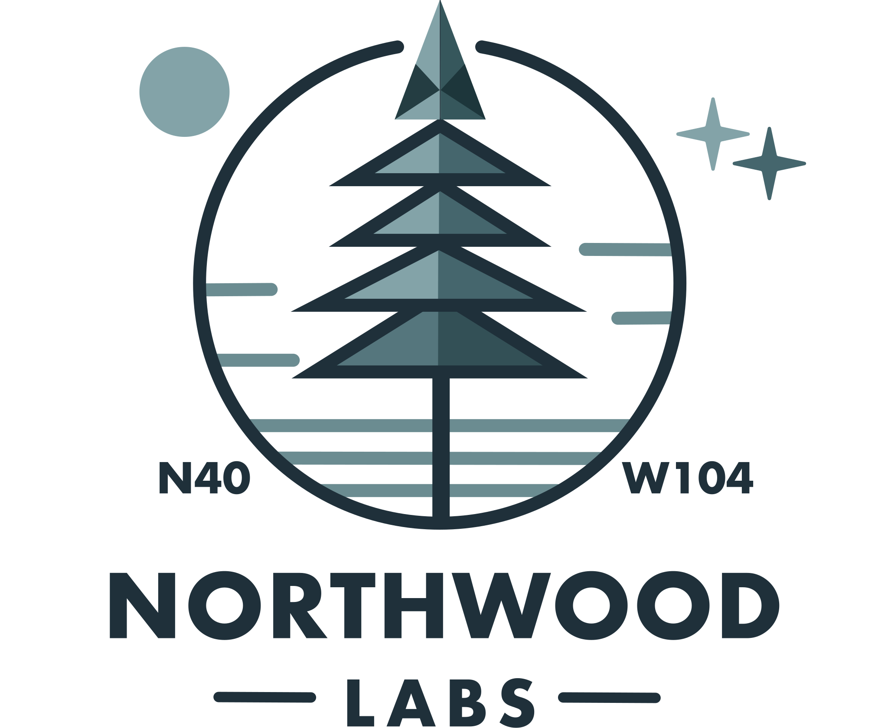
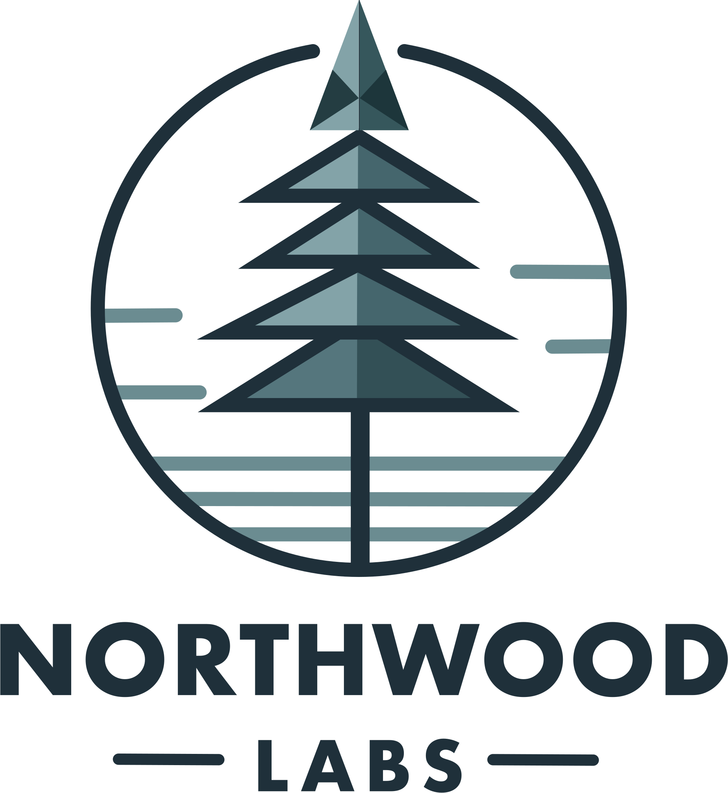
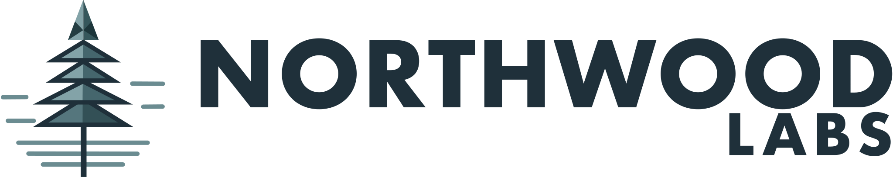
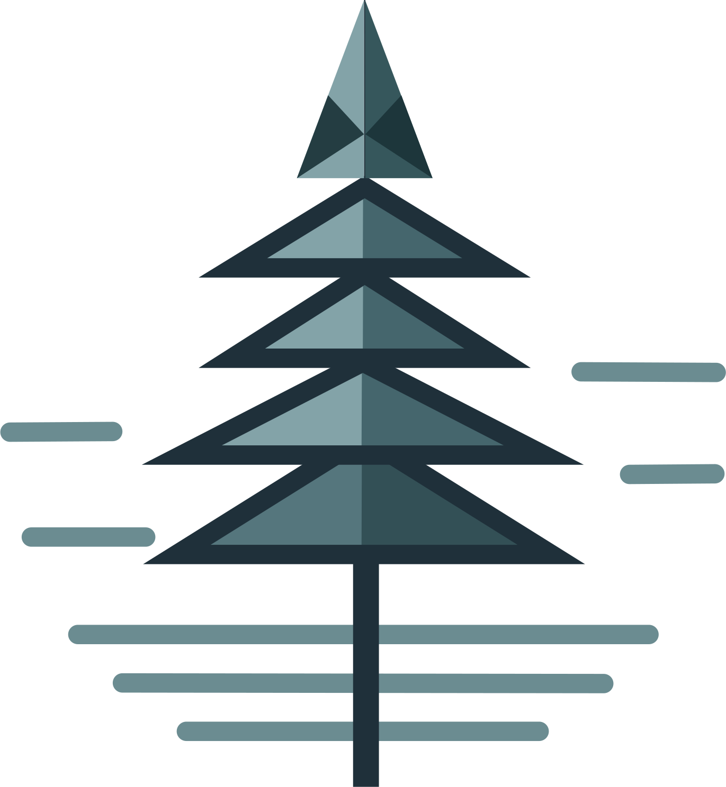
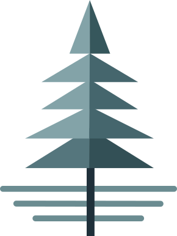

# Northwood Labs Branding Assets

**NOT permitted** for use outside of Northwood Labs-authorized works.

A public brand-usage guide will come in the future.

## Typeface

The _Northwood Labs_ text is set in _Futura Bold_.

## Colors

| Style      | Light mode | Dark mode |
|------------|------------|-----------|
| `shade-01` | `#1d363b`  | `#83a3a8` |
| `shade-02` | `#1f303a`  | `#eee`    |
| `shade-03` | `#243d42`  | `#eee`    |
| `shade-04` | `#335056`  |           |
| `shade-05` | `#36575c`  |           |
| `shade-06` | `#45666d`  |           |
| `shade-07` | `#55767d`  |           |
| `shade-08` | `#6b8c91`  |           |
| `shade-09` | `#83a3a8`  |           |
| `shade-10` | `#fff`     |           |

### CSS

```css
.shade-01 { fill: #1d363b; }
.shade-02 { fill: #1f303a; }
.shade-03 { fill: #243d42; }
.shade-04 { fill: #335056; }
.shade-05 { fill: #36575c; }
.shade-06 { fill: #45666d; }
.shade-07 { fill: #55767d; }
.shade-08 { fill: #6b8c91; }
.shade-09 { fill: #83a3a8; }
.shade-10 { fill: #fff; }

@media (prefers-color-scheme: dark) {
  .shade-01 { fill: #83a3a8; }
  .shade-02 { fill: #eee; }
  .shade-03 { fill: #eee; }
}
```

## Styles

### Full • Bougie • Extra (Vertical)

This is used when we want something full-featured and splashy. This the _most official_ version.

<div align="center">
  <picture>
    <source media="(prefers-color-scheme: dark)" srcset="NWL-Full-Vertical-Color-Inverted.svg" width="500">
    
  </picture>
</div>

### Simplified (Vertical)

This is used when we don't want as much splash. We drop the decorative symbols and text from around the circled tree.

<div align="center">
  
</div>

### Simplified (Horizontal)

This is used when the vertical version doesn't make sense. Changes from the _Simplified (Vertical)_ version move the text up to the right of the icon, and "Labs" is shifted to the right edge. This also gives the logo a silhouette of a key. (We initially made the mistake of moving it to the left, and it had the silhouette of a penis.)

<div align="center">
  
</div>

### Bug-only

This is used when we just need a square-ish visual indicator. We strip away the text below the bug, and remove the circle from around the tree. (We found that at smaller sizes, the circle was visually distracting and didn't add anything.)

<div align="center">
  
</div>

### Gravatar

Our _Globally-Recognizable Avatar_ (Gravatar) is the same as _Bug-only_, with a single modification. Typically, these graphics are edge-to-edge with extra transparent pixels removed. For this version, we expand the canvas around the logo by 20%. This extra whitespace makes it look cleaner when used for profile icons with both square-shaped and circular-shaped masks.

<div align="center">
  
</div>

### Favicon

Typically favicons are rendered at 16x16@2x, so they need to be discernable at very small sizes. For this use-case, we remove the border from the groups of tree _leaves_. Also, we simplify the top-most portion of the tree to 2 colored sections (down from 6).

<div align="center">
  
  
  
</div>

### One-offs

There are a few "non-official" logos that are used in some really specific circumstances when the normal logos don't work. These are used for things like LinkedIn and Google Workspace. These should only be used in that one place and not re-used other places if it can be avoided.

<div align="center">
  
</div>
